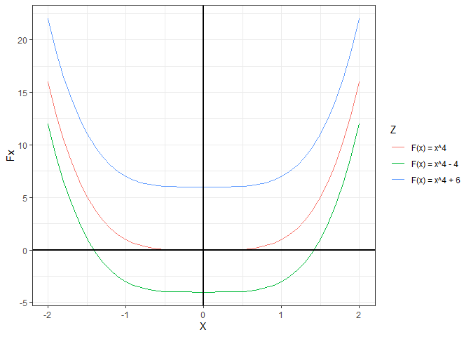

<!-- README.md is generated from README.Rmd. Please edit that file -->

## Derivadas

### Definición

------------------------------------------------------------------------

## Antiderivadas (Integrales)

,
denominada **antiderivada** de

en el intervalo

si
=f(x)")
en
;
donde
 = f(x)"),
.

De esto se desprende:

-   dx = f(x)")

-   dx=f(x)+C")

<!-- -->

### Teorema A. Regla de la potencia

Si

es cualquier número racional, excepto -1, entonces

Se deducen dos cosas:

-   Caso
    :

    

-   Como no se especificó ningún intervalo, es tácito que la integral es
    válidad solo en los intervalos donde
    
    está definida.

    -   Si
        ,
        entonces el intervalo
        
        no debe incluir
        .

    -   A esta integral donde no se le define el intervalo
        
        se le denomina **integral indefinida**, en lugar de
        antiderivada.

### Teorema B. Integral de senos y cosenos

dx=-cox(x)+C
")

dx=sen(x)+C
")

### Teorema C. La integral definida es un operador lineal

Suponga que

y

tienen antiderivadas (integrales indefinidas) y sea

una constante. Entonces:

-   dx=k\int_{}{}f(x)dx")

-   ![\\int\_{}{}\[f(x) + g(x)\]dx = \\int\_{}{}f(x)dx + \\int\_{}{}g(x)dx](https://latex.codecogs.com/png.image?%5Cdpi%7B110%7D&space;%5Cbg_white&space;%5Cint_%7B%7D%7B%7D%5Bf%28x%29%20%2B%20g%28x%29%5Ddx%20%3D%20%5Cint_%7B%7D%7B%7Df%28x%29dx%20%2B%20%5Cint_%7B%7D%7B%7Dg%28x%29dx "\int_{}{}[f(x) + g(x)]dx = \int_{}{}f(x)dx + \int_{}{}g(x)dx")

-   ![\\int\_{}{}\[f(x)-g(x)\]dx = \\int\_{}{}f(x)dx - \\int\_{}{}g(x)dx](https://latex.codecogs.com/png.image?%5Cdpi%7B110%7D&space;%5Cbg_white&space;%5Cint_%7B%7D%7B%7D%5Bf%28x%29-g%28x%29%5Ddx%20%3D%20%5Cint_%7B%7D%7B%7Df%28x%29dx%20-%20%5Cint_%7B%7D%7B%7Dg%28x%29dx "\int_{}{}[f(x)-g(x)]dx = \int_{}{}f(x)dx - \int_{}{}g(x)dx")

### Teorema D. Regla generalizada de la potencia

-   ![\\int\_{}{}\[g(x)\]^rg'(x)dx = \\frac{\[g(x)\]^{r+1}}{r+1}+C](https://latex.codecogs.com/png.image?%5Cdpi%7B110%7D&space;%5Cbg_white&space;%5Cint_%7B%7D%7B%7D%5Bg%28x%29%5D%5Erg%27%28x%29dx%20%3D%20%5Cfrac%7B%5Bg%28x%29%5D%5E%7Br%2B1%7D%7D%7Br%2B1%7D%2BC "\int_{}{}[g(x)]^rg'(x)dx = \frac{[g(x)]^{r+1}}{r+1}+C")

### Extras

-   ![\\int\_{}{}\[f(x)g'(x) + g(x)f'(x)\]dx = f(x)g(x) + C](https://latex.codecogs.com/png.image?%5Cdpi%7B110%7D&space;%5Cbg_white&space;%5Cint_%7B%7D%7B%7D%5Bf%28x%29g%27%28x%29%20%2B%20g%28x%29f%27%28x%29%5Ddx%20%3D%20f%28x%29g%28x%29%20%2B%20C "\int_{}{}[f(x)g'(x) + g(x)f'(x)]dx = f(x)g(x) + C")

-   f'(x) - f(x)g'(x)}{g^2(x)}dx = \frac{f(x)}{g(x)} + C")

## Sumatorias

### Teorema A. Linealidad de 

Si c es una constante, entonces

-   

    

-   

     = \sum_{i=1}^{n}a_i + \sum_{i=1}^{n}b_i")

-   

     = \sum_{i=1}^{n}a_i - \sum_{i=1}^{n}b_i")

### Formulas de sumatorias conocidas

-   

     = a_{n+1} - a_1")

-   

    ![\\sum\_{i=1}^{n}\[(i + 1)^2 - i^2\] = (n+1)^2-1](https://latex.codecogs.com/png.image?%5Cdpi%7B110%7D&space;%5Cbg_white&space;%5Csum_%7Bi%3D1%7D%5E%7Bn%7D%5B%28i%20%2B%201%29%5E2%20-%20i%5E2%5D%20%3D%20%28n%2B1%29%5E2-1 "\sum_{i=1}^{n}[(i + 1)^2 - i^2] = (n+1)^2-1")

-   

    }{2}")

-   

    (2n+1)}{6}")

-   

    ![\\sum\_{i=1}^{n}i^3 = \[\\frac{n(n+1)}{2}\]^2](https://latex.codecogs.com/png.image?%5Cdpi%7B110%7D&space;%5Cbg_white&space;%5Csum_%7Bi%3D1%7D%5E%7Bn%7Di%5E3%20%3D%20%5B%5Cfrac%7Bn%28n%2B1%29%7D%7B2%7D%5D%5E2 "\sum_{i=1}^{n}i^3 = [\frac{n(n+1)}{2}]^2")

-   

    (2n+1)(3n^2 + 3n - 1)}{30}")
